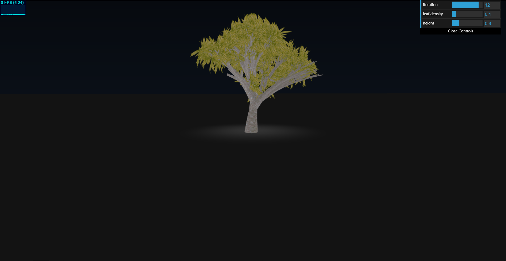

# CIS 566 Homework 4: L-systems

## ID
 - __Name:__ Jiangping Xu
 - __PennKey:__ xjp

Reference & Citation
----------
[use textures in WebGL](https://developer.mozilla.org/en-US/docs/Web/API/WebGL_API/Tutorial/Using_textures_in_WebGL) \
[the leaf model](https://free3d.com/3d-model/plant-model-352.html)

Demo
---------
https://haco77.github.io/hw04-l-systems/
\
use mouse to control the camara

Implementation Details
----------
- Tree Structre. The structure of the tree is generated randomly by L-System. A initial grammar is expanded iteratively based on expansion rules to a long string which contains the structure of the tree. My grammar settings are: \
__F__: the initial grammar. F is mapped to a string with a form of "CCCB" where the value of C is chosen randomly among several possible values. This forms the trunk of the tree.  
__C__: C doesn't expand. It serves as an auxiliary grammar to extend the branches or the trunk.
__B__: B is expanded to three possible string, "[+CG][--CG][CG]", "[+CG][CG]", "[+CG][--CG][++CG][CG]". It's the bifurcation point.
__G__: G is mapped to three possible string "CG" (extending one unit length), "[C[*]C[*]G*]+C[*]C[*]G*" (generating two new branches), "C[+C[*]C[*]][C[*]C[*]]-C[*]C[*]" (the end of the branch).
__*__: leaf. No expansion.
__+__: rotate counterclockwise.
__-__: rotate clockwise. \

- Base Models. The 3d models of trunk and leaf are loaded from .obj file. Their VBOs are created at the beginning including scale and deformation (the trunk.obj is just a simple cylinder and it's transformed into a capped cone). The textures are loaded at the same time and are saved in texture slot 0 and 1.

- Randomness. Each expansion rule have three possible resulting string, determined by two thresholds. Everytime expanding a character, a random number is generated and is compared with the two thresholds to decide which new string to append. The drawing rules also add randomness that every drawing rule will rotate the trunk segments a small random degree about a random axis. The random degree to rotate is modified according to the distance from the root, since we don't want severe rotation at the root. If a drawing rule has rotation as input, I weighted average the random axis and desired roatation axis so only one rotation is performed.

- Instanced Rendering. I use instanced rendering, i.e., drawing a single trunk segment and leaf lots of times with different translation, rotation, and scale. The tansformation matrix is seperated into 4 vec4s to send to the GPU side.

- Procedural Background. The ground is generated in fragment shader using ray-tacing. The color of the ground is generated using smoothstep. The color of the sky is interpolated based on the length of the projection of the ray (camera to that pixel) in y axis.

Scene Shot
---------
